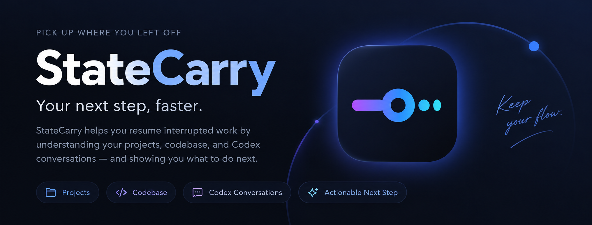
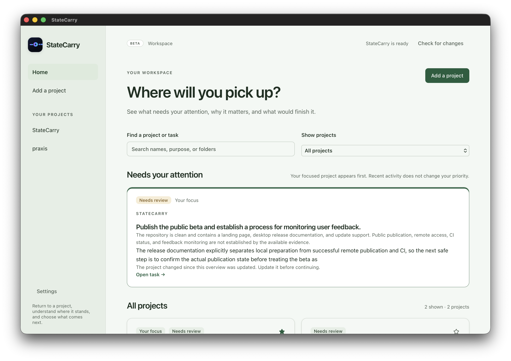
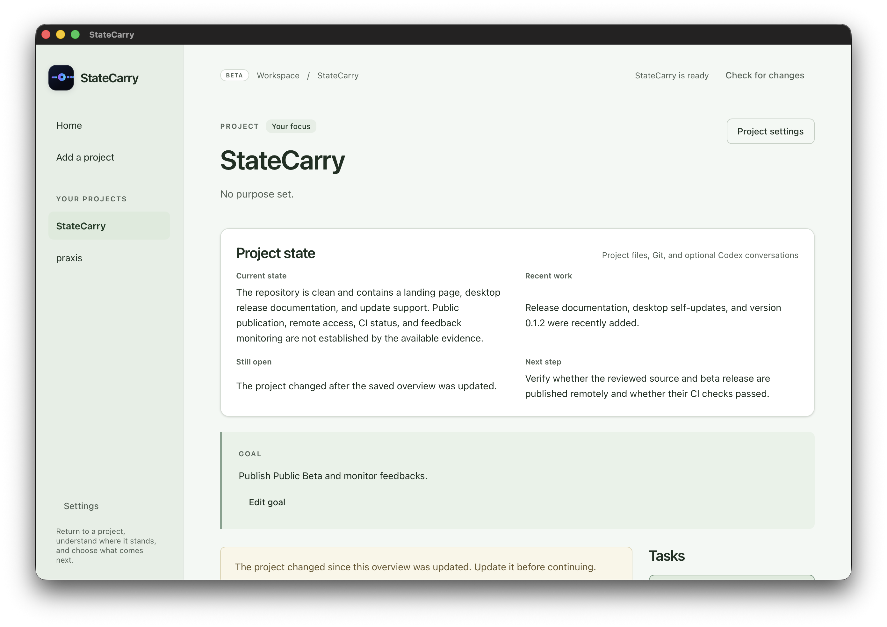
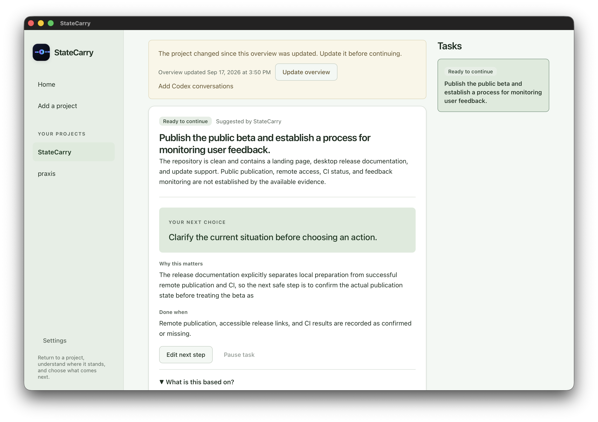
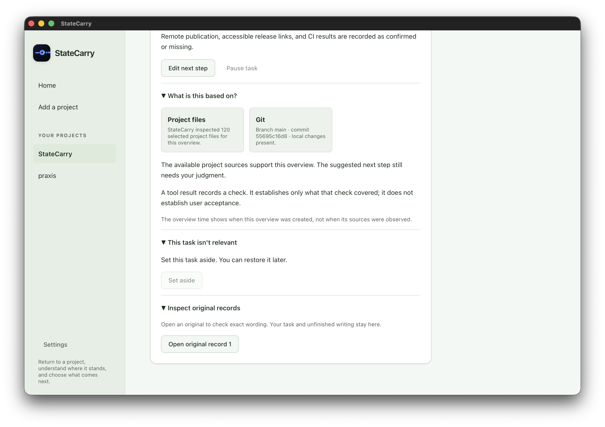
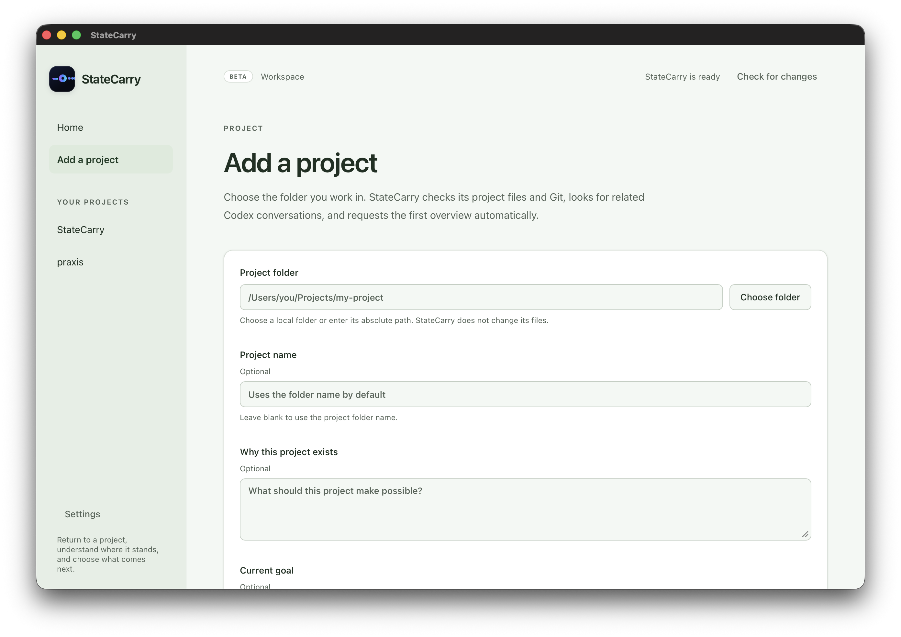
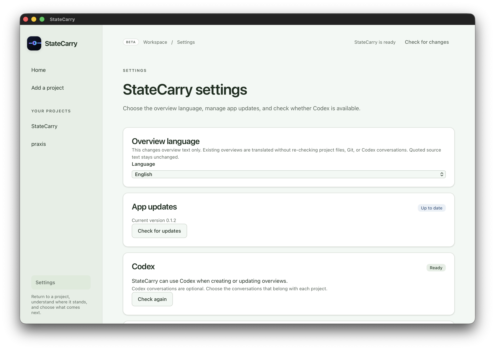

<p align="center">
  <a href="https://statecarry.threelight-studio.com">
    
  </a>
</p>

<p align="center"><strong>Return to a project, understand where it stands, and choose what to do next.</strong></p>

<p align="center">
  <a href="https://statecarry.threelight-studio.com">Website</a> ·
  <a href="https://github.com/ThreeLightStudio/statecarry/releases/latest/download/macos-arm64-StateCarry.dmg">Download Beta</a> ·
  <a href="#first-use">Docs</a> ·
  <a href="LICENSE">MIT License</a>
</p>

<p align="center"><sub>Public beta · Apple Silicon macOS · Open source</sub></p>

StateCarry helps you return to interrupted development work without reconstructing the whole project from memory. Home helps you choose across projects; each project explains the current state, the work that needs a decision, why it matters, and what would finish the next step.

**Choose a project → understand the work → choose the next step.** Prepared explanations stay readable without opening transcripts. Original records remain available when you want to inspect the basis. Reported completion, a recorded check, and your acceptance remain distinct.

> [!NOTE]
> StateCarry is in public beta. The current release is for Apple Silicon macOS. Real-work validation and the remaining beta work are tracked in the [implementation milestones](docs/project-ui-implementation.md) and [roadmap](docs/roadmap.md).

StateCarry runs locally on your Mac. It does not execute the next action or send a message to Codex. Records and corrections are stored on your Mac. **Relevant conversation excerpts and scoped project observations, including limited file previews, are sent through your signed-in Codex account for model analysis; this is not offline AI.**

## Product preview

<sub>Screenshots from StateCarry 0.1.2.</sub>

### Find what needs your attention



### Return to the project



### Choose the next step



### Inspect the basis when you need it



<details>
<summary>More screens</summary>

### Add a project



### Settings



</details>

## Download

Download the latest signed and notarized public beta for Apple Silicon macOS:

**[Download StateCarry Public Beta](https://github.com/ThreeLightStudio/statecarry/releases/latest/download/macos-arm64-StateCarry.dmg)**

Install the app from the DMG into Applications and launch StateCarry from Finder. Stable desktop builds check for newer releases automatically; downloading an available update and restarting to apply it remain explicit actions. See [desktop automatic updates](docs/auto-update.md) for the update flow and [desktop release](docs/desktop-release.md) for release verification details.

## Run from source

Read [the architecture overview](docs/architecture.md) for the current runtime structure and [the Electrobun technology decision](docs/decisions/0001-electrobun.md) for the desktop-host choice.

Requirements: Apple Silicon macOS, Node **24.14.1+**, pnpm **10.33.2**, RTK on PATH, Codex CLI and desktop installed and signed in. Development used RTK 0.28.2 and Codex CLI 0.152.0. Other OS/CLI combinations are unverified.

- [Node](https://nodejs.org/en/download)
- [RTK](https://github.com/rtk-ai/rtk#installation) — required by the runtime adapter
- [Codex CLI](https://developers.openai.com/codex/cli/)
- [Codex desktop](https://developers.openai.com/codex/app/)

Open a terminal in the source folder, then:

```sh
rtk pnpm install --frozen-lockfile
rtk pnpm build
rtk proxy node dist/server.mjs
```

Open [StateCarry](http://127.0.0.1:4310). Keep the terminal running; Ctrl+C stops it. A prepared `dist/` can run without pnpm or the source, but still needs Node, RTK, Codex, and your login. Run it from the folder containing `dist/`.

An agent can install dependencies, build, and diagnose startup. Sign in yourself (`rtk proxy codex login` if needed); never share credentials. No separate API key is required. Model access and usage limits belong to your Codex account; there is no automatic model fallback.

## First use

1. Choose **Add a project** and select the local folder you work in. Add a recognizable name and optional purpose or goal. StateCarry checks project files and Git, looks for related Codex conversations, and requests the first overview automatically. Codex conversations are optional; a project can still be added when none are found or discovery fails.
2. Review or change the conversations StateCarry found through **Project settings** when needed. Exact record boundaries remain an advanced source-setting action, and existing ranges remain until you change them.
3. On **Home**, compare work that needs a choice, or find a project in the full list. Your explicitly selected focus can lead the list. Recent activity does not automatically establish priority. Selecting a task opens that same task in its project.
4. In the project, read the current situation, **Your next choice**, its reason, and finish condition. Continue in the working conversation when the recorded route is supported, or copy the task context to your working tool. Neither action performs the work. Review returned results before accepting them; pause or correct a suggestion when appropriate.
5. Choose **Update overview** when you want a fresh model-generated overview after the project changes. **Check for changes** reads current project state without generating a new overview. Editing a goal saves the goal and can make a previous overview out of date.

Returning reads the saved project state. New records or changed project conditions can mark it as needing review. Preparation performs a fresh collection and bounded analysis. A missing or failed overview shows the available context and a recovery choice instead of exposing a raw response. Opening **What is this based on?** explains the available basis and its limits. **Inspect original records** deliberately opens source material separately.

Routine collection checks are quiet when their result is unchanged. Actual record changes are grouped into a background read; the current explanation and unfinished input stay in place, and only the affected project's actions wait for that check. Returning to the app or choosing **Check for changes** reads the latest saved state and checks project files without starting AI analysis. File-only changes are checked on those reads, navigation and continuation preparation; this is not a continuous file watcher.

For first-time navigation setup, run the following command in an interactive terminal, replacing `YOUR_THREAD_ID` with a conversation you intend to open:

```sh
rtk proxy node dist/verify-connection.mjs --verify-navigation YOUR_THREAD_ID
```

The helper opens that conversation and asks you to inspect its title and content before recording confirmation. An accepted OS request alone is not proof of arrival. Existing navigation evidence is preserved. This diagnostic is optional for source checks and is not run by the automated tests.

| State             | What you see                                                     |
| ----------------- | ---------------------------------------------------------------- |
| Ready to continue | A next step, its reason and its finish condition                 |
| Result to review  | A reported result awaiting your evaluation and acceptance        |
| Waiting for input | The missing input or condition for resuming                      |
| Paused            | Work you deliberately deferred, with a way to restore it         |
| Decision needed   | What remains unclear; no invented executable next step           |
| Accepted          | The task you accepted; a successor objective is not manufactured |

You can edit the next step and finish condition, accept a reviewed task, pause it, or set a wrong suggestion aside. Corrections persist within their applicable record scope. Reopening a task reverses the corresponding choice; it does not rewrite the original record. Other tasks remain reachable within the same project.

Goal and next-step drafts, task selection, explanation-panel choices and reading position are stored in this browser per work. Returning from another screen or restarting keeps these drafts and their original versions. Review a draft against the current work before explicitly adopting a newer version for its save. A missing server task cannot be revived by local input. After a successful full project list, drafts belonging to removed registrations are cleared; disconnected registrations keep theirs. Storage failures are shown; clearing site data removes browser drafts, not saved server records. Unsaved registration and project-settings forms are separate from these work drafts.

**Project settings** separates purpose/focus, source scope, collection and saved-data removal. Disconnecting retains the same registration and its saved work. Reconnecting resumes that same project without creating a replacement or starting analysis. A separate removal preview describes which database records and exclusive source copies will be removed, which shared copies remain, and whether pending work prevents removal. Deleting project data is not reversible through reconnecting. Original folders/conversations, request receipts, separate diagnostic files and backups are retained; this is not secure physical erasure of every copy.

## Scope and data

StateCarry analyzes connected records, not every record on your device. Related sessions may form one candidate; unrelated goals may produce separate candidates. Analysis includes selected conversation excerpts, bounded observations and previews of project files, and workspace state. The excerpt budget is not a bound on the entire model request. Missing history is not proof of completion. Candidate ranking is a suggestion, not knowledge of your current priority.

The default storage is `~/.statecarry`. It contains private records, analysis output, and corrections; do not include it in a submission or sample. Only one server can write to a data directory. To use a separate local instance:

```sh
rtk proxy env STATECARRY_DATA_DIR=/absolute/path/to/private-data STATECARRY_PORT=4397 node dist/server.mjs
```

Open the matching port. The server binds to `127.0.0.1` and rejects unexpected Host/Origin headers. Do not expose it through public hosting or a tunnel. The public desktop release runs the same local service boundary inside the signed Apple Silicon application.

The isolated model reader disables execution tools. Original records remain untrusted evidence. Exact quote validation checks source references; it does not guarantee the model's interpretation is correct. Use correction when the suggested work or action is wrong.

The production entry now uses the Home/Project flow. Old Resume/work/detail bookmarks resolve to the corresponding project instead of opening the competing legacy UI. Historical UI modules and their regressions remain in source, but are not reachable through the new production entry. Legacy long-form background analysis remains disabled by default. `STATECARRY_LEGACY_ANALYSIS=1` still enables that older processing path and is unnecessary for this flow.

## Troubleshooting

- **Port already in use:** stop the existing server in its terminal or choose another port. Do not delete its database.
- **Records missing / partially collected:** check CLI login, selected session IDs and turn boundaries in connection settings. No action is shown when collection fails. Compressed or partial records are identified before acting.
- **Analysis failed:** check the visible error, account limits and configured model access, then retry. Existing records and corrections are retained.
- **App link does not open:** install/open Codex desktop, permit your browser's external-app link, or use the displayed session ID manually.
- **Unexpected task:** edit the next step or set the suggestion aside. A recent conversation is not necessarily the work you intend to continue.

## Development and release checks

```sh
rtk pnpm verify
```

`verify` uses the repository's local Turborepo cache for deterministic checks and the production
build. Use `rtk pnpm verify:fresh` when release evidence must execute those tasks instead of reading
prior cache entries. See [development](docs/development.md) for focused tests, the workspace layout,
cache boundaries, contribution guidance and diagnostics. The current signed/notarized macOS release
procedure is in [desktop release](docs/desktop-release.md), and the in-app stable updater contract is
in [desktop automatic updates](docs/auto-update.md).

## Known limitations

The owner approved the Home/Project replacement after reporting unclear flow and early raw-data exposure in the earlier UI. The new flow and scoped database removal are undergoing the checks recorded in the [implementation milestones](docs/project-ui-implementation.md). Passing automated checks and inspecting synthetic browser cases do not establish human comprehension, correct real model output, or a complete later work return.

Goal and correction drafts are local to the same browser profile and origin (including port); they are not synchronized between devices. A server disconnection keeps the already-loaded brief available for review in the current tab, while actions requiring current records remain blocked. Reconnection reloads saved results without starting analysis. Only drafts and reading preferences are written to browser storage, not server evidence or action permissions. After a completely new tab or browser process starts offline, the server must return before its saved brief can be read again.

Project explanations reuse validated structured current-state and reason fields, with prepared messages for known missing/failed states. Generation instructions require understandable project-specific prose, but do not independently verify the model's interpretation. Existing registrations retain their identities; registrations in the same folder are not automatically merged. Actual Codex arrival, real explanation quality and human work-return acceptance remain in the [roadmap](docs/roadmap.md).

Changing the goal or record scope hides the previous candidate until the selected records are checked. A temporary read failure can retain a same-scope brief with accessible supporting evidence, but its action remains blocked. An unchanged bounded file sample is shown as a limitation without forcing another identical analysis; it is not proof that every project file was checked.

The primary v0 scope excludes automatic task execution, full project management, new provider integrations and environment restoration. Stable application updates are supported on the current Apple Silicon desktop release. Existing auxiliary context screens are subject to a keep/move/remove review in the redesign; they are not a permanent requirement. Public desktop delivery and completed real-work validation remain separate kinds of evidence. Keep private `.cache/` observations out of shared source and builds.

## License

StateCarry is licensed under the [MIT License](LICENSE).

Copyright (c) 2026 ThreeLight Studio.

Third-party components retain their own licenses and attribution requirements. Workspace packages remain `private: true` to prevent accidental npm publication.

See [public source release preparation](docs/public-release.md) for the confirmed settings and publication checks, and
[third-party attribution](docs/third-party.md) for the reviewed dependency notices and binary-release limits.
