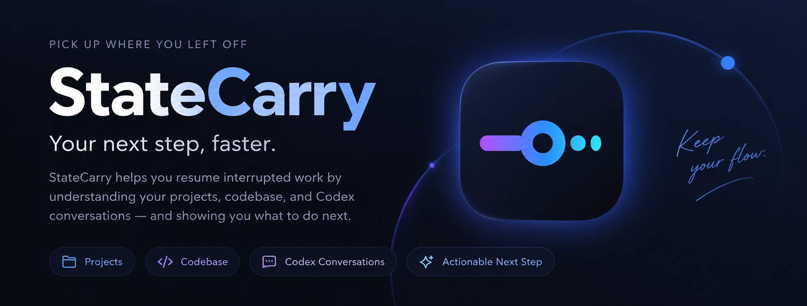
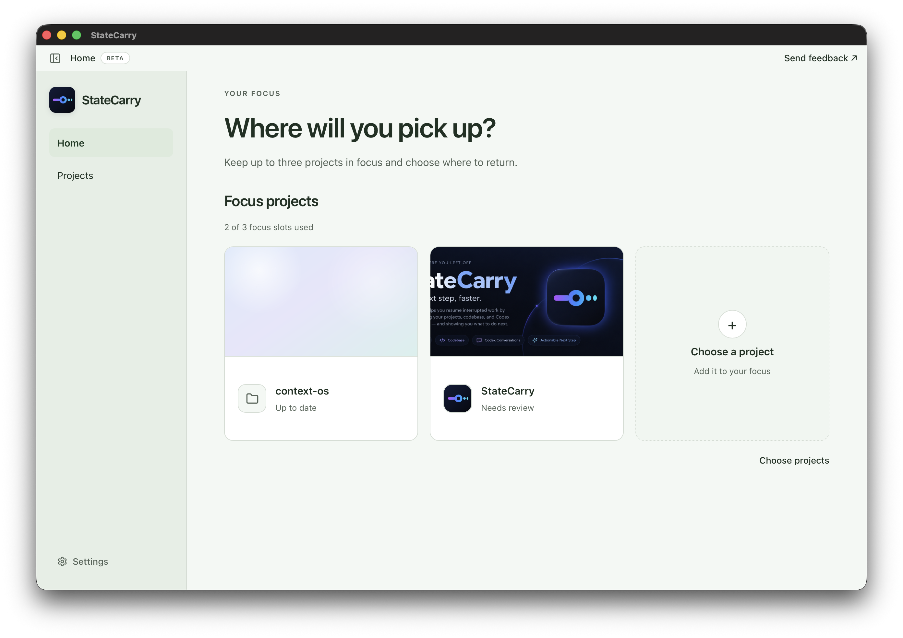
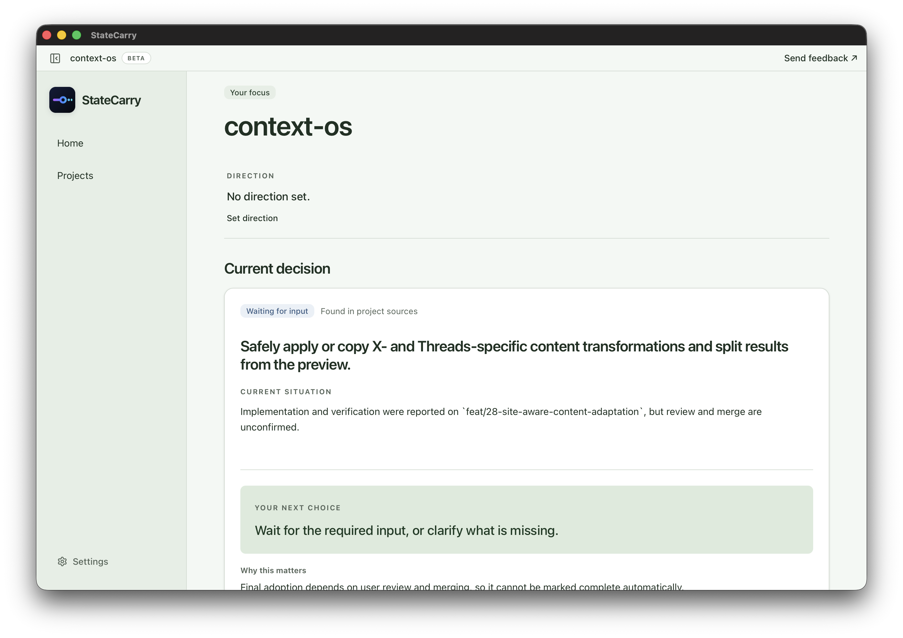
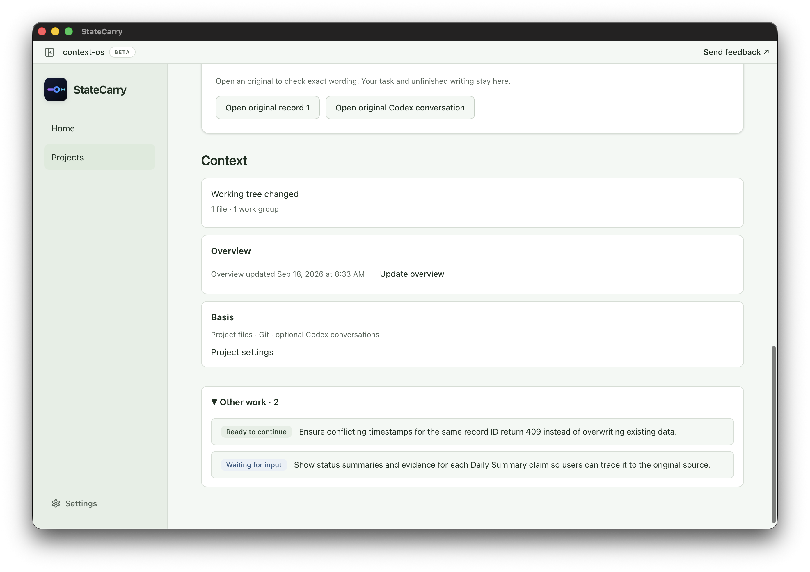
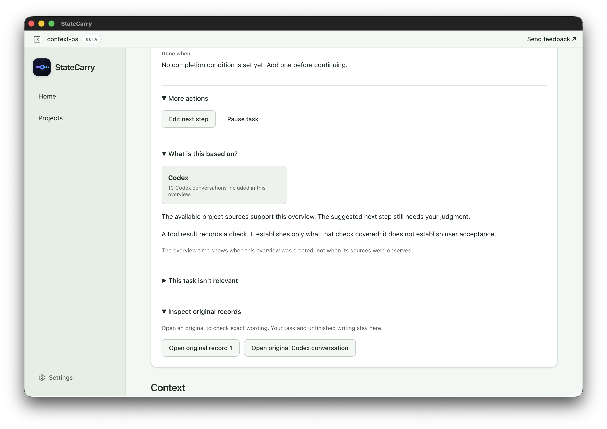
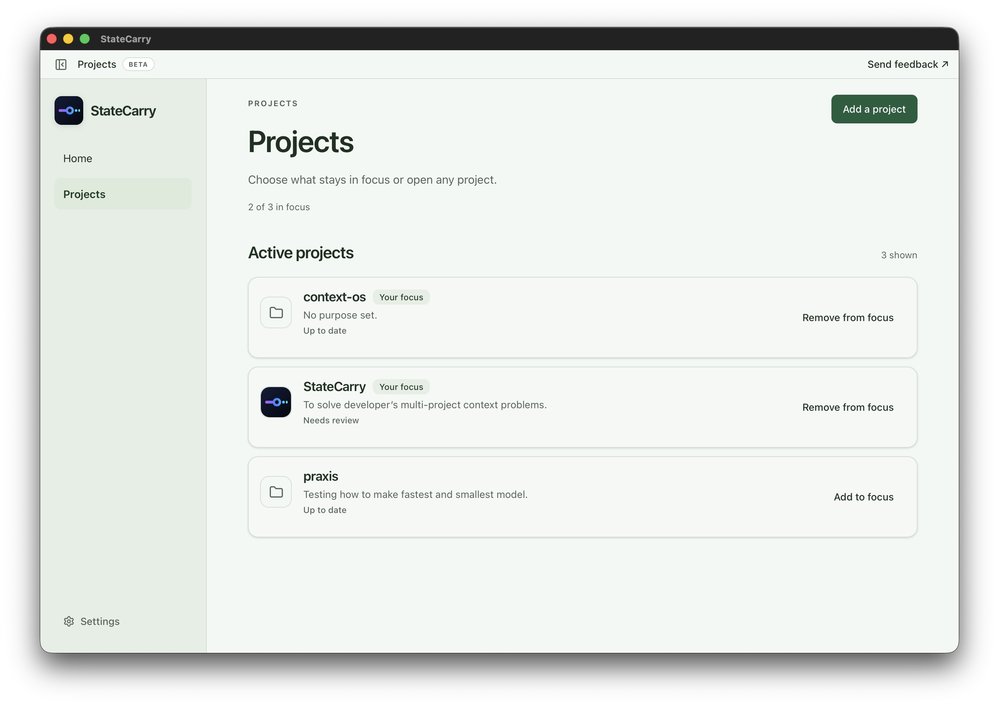
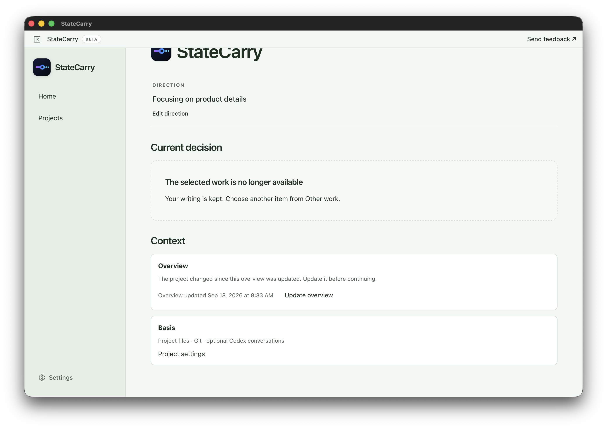

<p align="center">
  <a href="https://statecarry.threelight-studio.com">
    
  </a>
</p>

<p align="center"><strong>Return to an interrupted project, understand where it stands, and choose what to do next.</strong></p>

<p align="center">
  <a href="https://statecarry.threelight-studio.com">Website</a> ·
  <a href="https://youtu.be/vQpwQ_hr_ew">Demo</a> ·
  <a href="https://github.com/ThreeLightStudio/statecarry/releases/latest/download/macos-arm64-StateCarry.dmg">Download Beta</a> ·
  <a href="#first-use">Docs</a> ·
  <a href="README.ko.md">한국어</a> ·
  <a href="LICENSE">MIT License</a>
</p>

<p align="center"><sub>Public beta · Apple Silicon macOS · Open source</sub></p>

**Example:** you switch away while investigating an export bug, then return days later. StateCarry brings together the project's selected conversations and current Git/file observations so you can review its direction, the current decision, and the basis for a next step. An agent's “done” report remains a result to review; you decide whether to accept it.

The application keeps records and corrections on your Mac. **Selected conversation excerpts and bounded project observations, including limited file previews, are sent to the configured analysis provider. AI analysis is not offline.** The current source supports Codex and OpenRouter; the provider boundary is explained below.

## Product preview

[Watch the 1-minute demo on YouTube](https://youtu.be/vQpwQ_hr_ew)

<sub>Screenshots from StateCarry 0.1.8.</sub>

### Choose where to return



### Understand the current decision



### Check current project context



### Inspect the basis when it changes your decision



<details>
<summary>More screens</summary>

### Browse all projects



### Review an out-of-date overview



</details>

## Design decisions you can inspect

| Decision                                                                                                                                                              | Why it matters                                                                                           | Public evidence                                                                                                                                                                                                                                                                                                                                                                |
| --------------------------------------------------------------------------------------------------------------------------------------------------------------------- | -------------------------------------------------------------------------------------------------------- | ------------------------------------------------------------------------------------------------------------------------------------------------------------------------------------------------------------------------------------------------------------------------------------------------------------------------------------------------------------------------------ |
| Share the React UI and HTTP/SSE contract between source runs and the Electrobun desktop host. Keep presentation, core rules, contracts, and server adapters separate. | Desktop lifecycle and native capabilities can change without moving product rules into the native shell. | [Architecture](docs/architecture.md) · [Dependency boundary check](https://github.com/ThreeLightStudio/statecarry/blob/e793596d99cfcf253caf313f23f407cc43e16057/scripts/check-boundaries.ts)                                                                                                                                                                                   |
| Keep model reports, check evidence, and user acceptance separate.                                                                                                     | A plausible result or passing check cannot choose your priority or accept work for you.                  | [Behavior contract](docs/product-behavior-contract.md) · [Decision implementation](https://github.com/ThreeLightStudio/statecarry/blob/e793596d99cfcf253caf313f23f407cc43e16057/packages/core/src/project-model.ts) · [Acceptance fixtures](https://github.com/ThreeLightStudio/statecarry/blob/e793596d99cfcf253caf313f23f407cc43e16057/tests/project-workspace-core.test.ts) |
| Separate production and development profiles, with loopback services and a writer lock.                                                                               | Working on StateCarry should not open production records or attach to an unrelated running instance.     | [Runtime isolation](docs/runtime-isolation.md) · [Isolation fixtures](https://github.com/ThreeLightStudio/statecarry/blob/e793596d99cfcf253caf313f23f407cc43e16057/tests/runtime-isolation.test.ts)                                                                                                                                                                            |

The behavior contract describes intended rules; implementation and fixtures show the covered cases. Automated checks do not establish human comprehension or successful return to real work.

## Download and source status

**[Download StateCarry Public Beta for Apple Silicon macOS](https://github.com/ThreeLightStudio/statecarry/releases/latest/download/macos-arm64-StateCarry.dmg)**

Copy the app from the DMG into Applications and launch it from Finder. The [desktop release procedure](docs/desktop-release.md) covers signing, notarization, and Gatekeeper checks. Downloading an update and restarting to apply it are explicit actions; see [desktop automatic updates](docs/auto-update.md).

As of October 2, 2026, the latest published release is [v0.3.0](https://github.com/ThreeLightStudio/statecarry/releases/tag/v0.3.0), built from [`6204e71`](https://github.com/ThreeLightStudio/statecarry/commit/6204e719f6fd8ae345674449863da9059fce522b). The source evidence linked here uses later main revision [`e793596`](https://github.com/ThreeLightStudio/statecarry/commit/e793596d99cfcf253caf313f23f407cc43e16057); it does not establish that every later source behavior is in the downloadable binary. [Verify succeeded at that source revision](https://github.com/ThreeLightStudio/statecarry/actions/runs/36766925419). Release delivery, automated checks, and real-work acceptance are separate evidence.

## First use

1. Choose **Add a project**, select its local folder, and give it a recognizable name. StateCarry checks project files and Git, looks for related Codex conversations, and requests an initial overview. Conversations are optional.
2. Review selected conversations and source scope in **Project settings**. On **Home**, explicitly choose up to three projects to keep in focus; recent activity does not automatically set priority.
3. Read **Direction** and **Current decision**, including **Your next choice**, its reason, and its finish condition when available. Open the working conversation when supported, or copy a handoff. Opening or copying does not perform the work.
4. Use **Context** and **What is this based on?** when changed files or source evidence could alter the decision. Review returned results before accepting them; edit, pause, or set aside an incorrect suggestion.
5. Choose **Update overview** for fresh model analysis. Returning to the app reads saved state and checks project files without starting AI analysis.

See the [return content contract](docs/return-content-contract.md) and [implementation milestones](docs/project-ui-implementation.md) for the detailed flow, draft recovery, stale evidence, and remaining acceptance work.

## Run from source

Requirements: Apple Silicon macOS, Node **24.14.1+**, pnpm **10.33.2**, [Codex CLI](https://developers.openai.com/codex/cli/) and [Codex desktop](https://developers.openai.com/codex/app/) installed and signed in. The documented development CLI is 0.152.0; other OS/CLI combinations are unverified.

Before using an updated build with existing project data, read the [beta data-reset notice](docs/project-data-reset.md).

```sh
pnpm install --frozen-lockfile
pnpm build
node dist/server.mjs
```

Open the loopback URL printed by the server and keep the terminal running. The built server uses the production profile. For an isolated development profile, use `pnpm dev` (web UI at `http://127.0.0.1:4311`) or `pnpm desktop:dev`; both use the development API on port 4310. Run one development server at a time. See [development](docs/development.md) for focused checks, executable discovery, and diagnostics.

```sh
pnpm verify
```

`verify` can use the local Turborepo cache; `pnpm verify:fresh` executes the checks again for fresh evidence.

## Analysis and data boundaries

- **Provider selection:** the current main source reads the configured analysis agent on each call. Codex uses your signed-in account; OpenRouter requires your own API key. If a Codex error is classified as usage exhaustion and an OpenRouter key is available in settings or `OPENROUTER_API_KEY`, the whole analysis call is retried on OpenRouter. Subsequent calls use OpenRouter during the exhaustion window, then probe Codex again. Other Codex errors are propagated. This provider handoff is separate from silently substituting a model or effort inside Codex, which the Codex adapter rejects. See [provider implementation](https://github.com/ThreeLightStudio/statecarry/blob/e793596d99cfcf253caf313f23f407cc43e16057/apps/server/src/adapters/agent-summary.ts), [handoff fixtures](https://github.com/ThreeLightStudio/statecarry/blob/e793596d99cfcf253caf313f23f407cc43e16057/tests/agent-summary-failover.test.ts), and [Codex settings checks](https://github.com/ThreeLightStudio/statecarry/blob/e793596d99cfcf253caf313f23f407cc43e16057/apps/server/src/adapters/codex-summary.ts). Session collection and navigation remain Codex-based.
- **Scope:** analysis uses connected records and bounded project observations. Missing history is not proof of completion; the excerpt budget does not bound the entire model request. Original records are untrusted evidence. Quote/reference validation does not guarantee the interpretation is correct.
- **Persistence:** production records use `~/.statecarry`; development uses `~/.statecarry-dev`. Drafts and reading preferences are separate from server evidence and permissions. They are not synchronized between devices. See [runtime isolation](docs/runtime-isolation.md).
- **Local service:** the server binds to `127.0.0.1` and rejects unexpected Host/Origin headers. Keep it off public hosting and tunnels. Account credentials, private records, and `.cache/` observations stay outside shared source and builds.
- **Removal:** disconnecting retains the registration and saved work. A separate removal preview identifies affected records and source copies; reconnecting does not undo deletion. Original folders/conversations and separate receipts, diagnostics, or backups are retained. See [scoped removal implementation](https://github.com/ThreeLightStudio/statecarry/blob/e793596d99cfcf253caf313f23f407cc43e16057/packages/core/src/project-deletion.ts).

## Limits and further reading

The beta does not promise automatic task execution, full project management, or environment restoration. Browser drafts depend on their profile and origin; a new offline tab needs the server before it can read the saved brief. File observations are bounded samples, not continuous monitoring of every file. A failed or stale basis can block an action while retained context remains readable.

Actual arrival in the intended Codex conversation, real model explanation quality, and human work-return acceptance remain separate checks in the [roadmap](docs/roadmap.md) and [implementation milestones](docs/project-ui-implementation.md). The optional navigation diagnostic requires you to inspect the destination; an accepted OS request alone is not proof of arrival. See [development](docs/development.md) for troubleshooting and [public source release preparation](docs/public-release.md) for publication boundaries.

## License

[MIT](LICENSE) · Copyright (c) 2026 ThreeLight Studio. Workspace packages remain `private: true` to prevent accidental npm publication. Third-party components retain their licenses; see [third-party attribution](docs/third-party.md).
