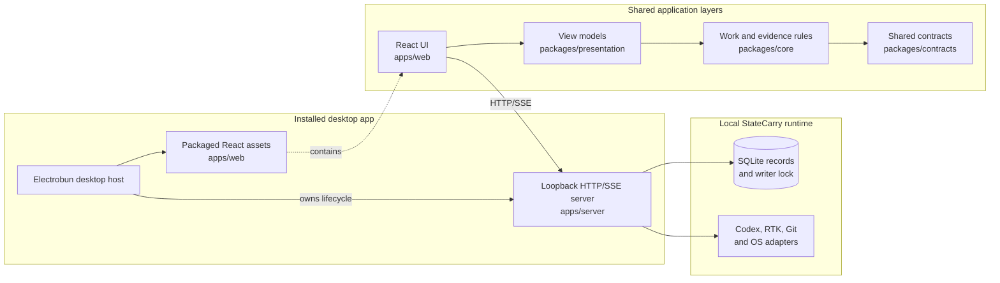
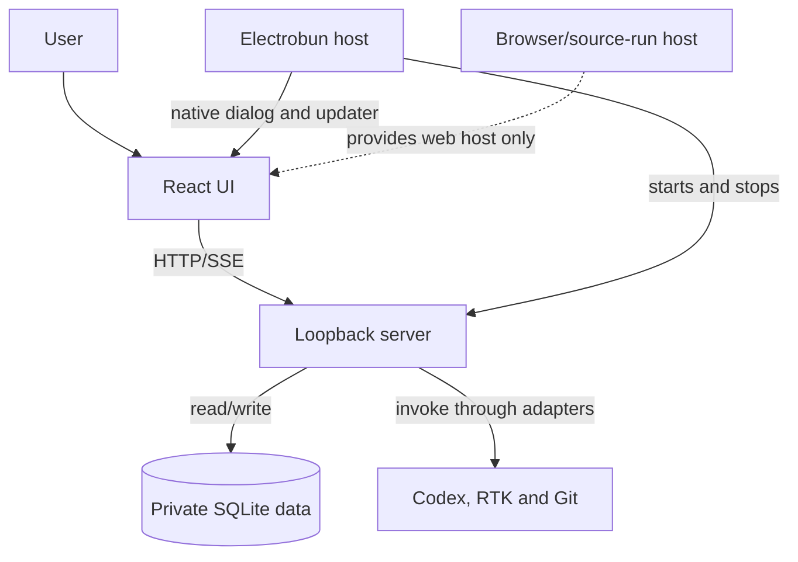

# Architecture

Status: current macOS Apple Silicon architecture, verified through the public beta desktop delivery path on 2026-09-17 KST.

StateCarry is a local Mac application with a browser-based React UI. The installed application adds a native host around the existing web workflow; it does not replace the web UI with a separate native presentation layer.

## System shape

The same React application and HTTP contract are used in source-run and installed-app environments. This keeps product behavior and browser testing close to the implementation that ships, while the desktop host supplies capabilities unavailable to a normal browser, such as native directory selection and application updates.

The main ownership and request path is shown below. Electrobun owns the runtime it starts; the server owns persisted StateCarry records and external-tool adapters; the web UI consumes the server contract.

## Responsibilities and boundaries

| Area                    | Responsibility                                                                                             |
| ----------------------- | ---------------------------------------------------------------------------------------------------------- |
| `apps/desktop`          | Electrobun main process, native window integration, app lifecycle, desktop-only ports and updater bridge   |
| `apps/web`              | React presentation and browser interaction; communicates with the server through HTTP/SSE adapters         |
| `apps/server`           | Local API, SQLite persistence, record collection, analysis orchestration and operating-system integrations |
| `packages/contracts`    | Shared data shapes and API-facing contracts                                                                |
| `packages/core`         | Work, evidence, analysis and continuation rules without browser or network ownership                       |
| `packages/presentation` | UI-independent view models and interaction controllers                                                     |
| `scripts`               | Development, checks, boundaries and packaging support                                                      |

The intended dependency direction is from the web layer through presentation and core contracts. UI code does not import server adapters or core implementation directly. The checked-in boundary check protects this arrangement; the detailed source layout and command contract are maintained in [development](development.md) and [the tooling and desktop delivery plan](tooling-and-desktop-plan.md).

## Runtime and data flow

In source-run mode, the server is started from the repository and the browser opens its loopback address. In the installed app, Electrobun starts the packaged web view and the app-owned server runtime. The server binds to loopback, serves the existing API and SSE workflow, and writes to the selected private data directory.

StateCarry owns the runtime it starts, including the SQLite writer lock and related local processes. It detects a port or writer conflict and does not terminate an unrelated StateCarry process. Private server records are separate from browser-local drafts, reading preferences and temporary UI state. The browser does not grant action permissions merely because a draft exists; actions requiring current records are revalidated by the server.

The server invokes Codex, RTK and Git through operating-system adapters. Those tools are external dependencies of the runtime, not capabilities supplied by Electrobun. Installed-app executable discovery therefore has to work with the reduced environment normally present when an app is launched from Finder.

## Electrobun's role

Electrobun is the native shell and distribution layer. In this project it provides:

- the macOS application host and main-process lifecycle;
- packaged web assets and application launch outside the source directory;
- native directory selection through the existing folder-picker port;
- Developer ID signing, notarization and DMG generation;
- stable-channel update discovery, download, replacement and relaunch.

Electrobun does not own StateCarry's product rules, SQLite data model, local API or Codex analysis. The normal quit and update restart paths must coordinate the Electrobun lifecycle with the server shutdown sequence. See [desktop automatic updates](auto-update.md) for that protocol and [desktop release](desktop-release.md) for the operator procedure.

## Execution environments

| Environment             | Host                               | UI and API                                           | Main limitation                                   |
| ----------------------- | ---------------------------------- | ---------------------------------------------------- | ------------------------------------------------- |
| Source-run              | Node and the development launcher  | React source/build plus loopback server              | Requires the documented local tools and login     |
| Browser/source workflow | Browser                            | Same HTTP/SSE contract                               | No native updater or native dialog implementation |
| Installed desktop app   | Electrobun Cottontail main process | Packaged React assets plus app-owned loopback server | Current supported delivery is macOS Apple Silicon |

The desktop framework is pinned in the existing pnpm workspace. The server currently runs under the tested Cottontail build, so the workspace remains Node/pnpm-based rather than being migrated to Bun solely because Electrobun is used. This compatibility boundary and its fallback policy are recorded in [the Electrobun decision](decisions/0001-electrobun.md).

## Related documents

- [Electrobun technology decision](decisions/0001-electrobun.md)
- [Tooling and desktop delivery plan](tooling-and-desktop-plan.md)
- [Desktop automatic updates](auto-update.md)
- [Desktop release runbook](desktop-release.md)
- [Development and source layout](development.md)
- [UI and interaction principles](ui-principles.md)
- [UX writing and technical disclosure rules](ux-writing.md)
