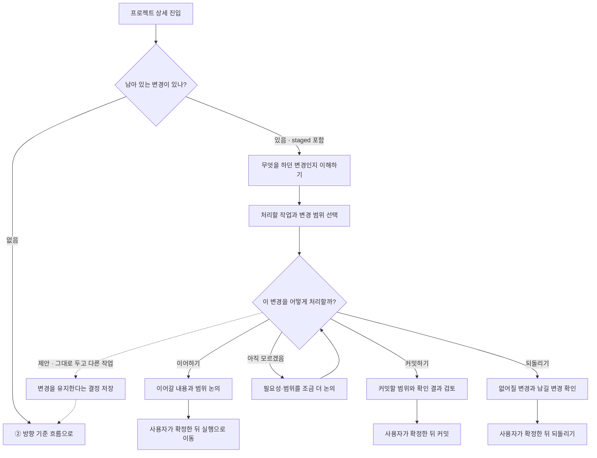
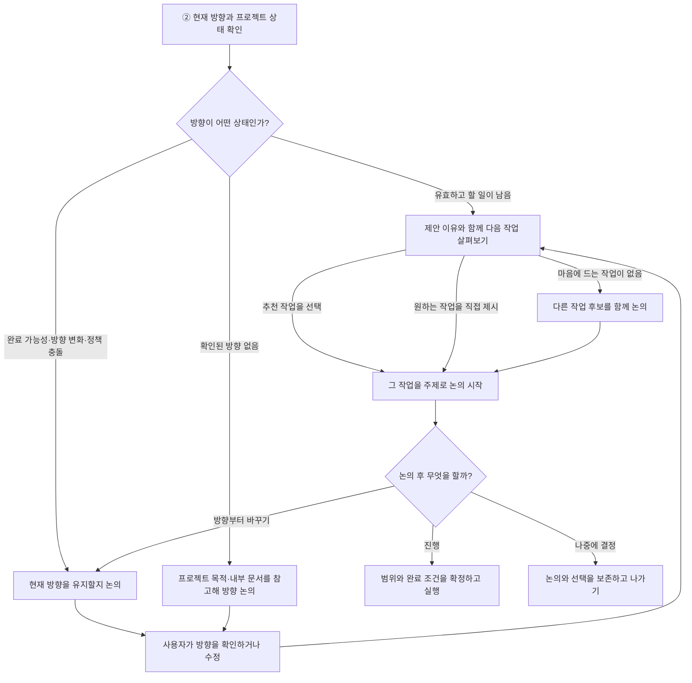

# StateCarry 프로젝트 상세 진입 흐름 — 논의안

현재 구현이 아니라 합의 중인 목표 동작. 변경을 남겨두고 이동하는 점선 경로는 미확정 제안.

## ① 남아 있는 변경 처리

<!-- mermaid:id=remaining_changes -->

## ② 방향과 다음 작업 논의

<!-- mermaid:id=direction_and_next_work -->

## 확정 상태와 설계 인계 조건

- 상태: 논의안 보존. 최종 확인 전이며 UI/UX 설계 및 구현 변경의 확정 기준으로 사용하지 않는다.
- 다음 순서: 미정 사항 답변 → 다이어그램 반영 → 사용자 최종 확인 → UI/UX 설계 인계.
- 이 문서의 다이어그램은 현재 구현 여부를 설명하지 않는다.

## 유지할 기준

- staged와 unstaged를 모두 남아 있는 변경으로 본다.
- 변경 묶음은 현재 남은 변경을 이해하고 처리하기 위한 분류다. 사용자 의도나 다음 작업의 확정으로 취급하지 않는다.
- 작업의 설명을 먼저 이해하고, 처리 범위와 행동을 선택한다.
- 커밋할 변경과 되돌릴 변경은 선택 범위를 확인한 뒤 확정한다. staged 해제와 실제 수정 내용 폐기는 구분한다.
- 깨끗한 Git 상태만으로 작업이나 방향의 완료를 판단하지 않는다. 결과 검토·검증도 다음 작업이 될 수 있다.
- 프로젝트 목적과 현재 방향은 구분한다. 코드베이스의 문서에서 찾은 방향은 근거와 함께 추천하며 사용자 확인 없이 현재 방향으로 확정하지 않는다.
- 추천 작업 선택은 해당 작업에 관한 논의를 시작한다. 사용자가 직접 원하는 작업을 제시하는 경로도 유지한다.
- 논의를 시작하거나 답변을 읽는 것만으로 목표 수정, 작업 실행, 결과 수락이 발생하지 않는다.
- 상태를 확인하지 못한 경우를 변경 없음으로 취급하지 않는다. 마지막으로 아는 상태와 확인할 수 없는 부분을 구분한다.

## 기존 실행 범위와 최종 도식의 표현

- 현재 작업의 논의는 StateCarry 안에서 작업에 붙여 진행한다.
- 앞서 정한 범위에서 목표 정의 논의와 실제 코딩은 Codex로 연결한다. 자동 전송이 지원되지 않으면 요청문 준비·복사를 제공하며 실행했다고 표시하지 않는다.
- 현재 범위는 로컬 파일 변경·커밋·복원을 StateCarry가 직접 수행하는 것을 필수로 하지 않는다. 따라서 위 도식의 ‘커밋’, ‘되돌리기’, ‘실행’은 목표 행동을 나타낸다. 최종 도식에서는 StateCarry 안의 검토·요청 준비와 외부 실행을 구분해 표시한다.
- 커밋·되돌리기 후 프로젝트 상태를 다시 확인하고 남은 변경이 있으면 해당 흐름으로 돌아온다. 일부 처리로 나머지 변경이 사라지거나 완료된 것으로 간주하지 않는다.

## 미정 사항

| ID  | 결정할 내용                                                 | 제안                                                                                                                                                            | 상태             |
| --- | ----------------------------------------------------------- | --------------------------------------------------------------------------------------------------------------------------------------------------------------- | ---------------- |
| D1  | 변경을 남겨두고 방향·다른 작업으로 넘어갈 수 있는가         | 허용한다. 어느 변경을 남겼는지 기억하고, 해당 변경에 새 정보가 생기거나 사용자가 다시 열 때 재검토한다. 넘어간 뒤에도 변경이 남아 있다는 사실은 확인할 수 있다. | 사용자 답변 대기 |
| D2  | 사용자 방향과 코드베이스 정책이 충돌할 때 무엇을 우선하는가 | 충돌과 영향을 설명하고, 방향 조정과 정책 변경 중 무엇을 할지 사용자가 논의해 결정한다. 미해결 충돌에 의존하는 실행은 시작하지 않는다.                           | 사용자 답변 대기 |

## 최종 확인에서 함께 볼 항목

- 첫 화면이 왜 변경 또는 작업을 보여주는지 설명하는가.
- 처리 범위 선택, 논의 시작, 실제 실행 확정이 각각 구분되는가.
- 완료·보류·다른 작업 선택 시 사용자를 불필요하게 새 작업으로 밀어 넣지 않는가.
- 미정 사항이 확정으로 표시되기 전에 사용자 답변이 기록돼 있는가.
