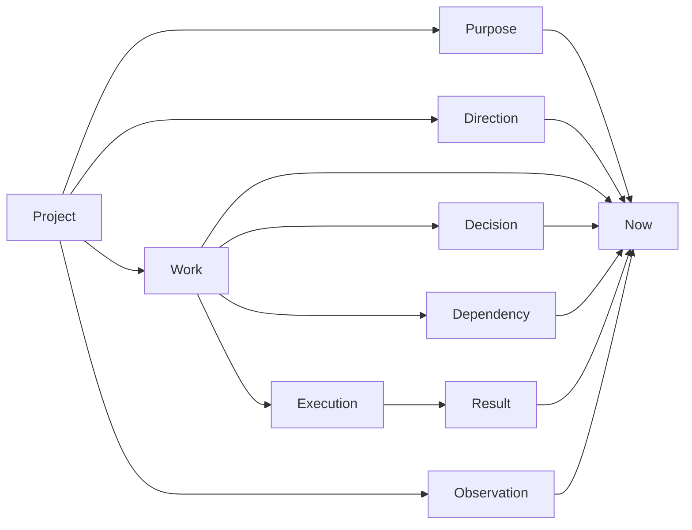

# StateCarry product behavior contract

Status: **approved product contract, 2026-09-21 KST.**

This document records the product behavior, prioritization, return-flow and presentation decisions
approved during the 2026-09-21 redesign discussion. It is a design and behavior contract, not a claim
that the current application already implements every rule below.

When this document conflicts with an older Project-detail prototype or flow document, use this
document for new implementation work. `ui-principles.md` remains the structural UI contract and
`ux-writing.md` remains the active copy contract; both should express the behavior defined here.

The current-code transition is mapped in [product-model-migration.md](product-model-migration.md).

## 1. Product purpose

StateCarry exists to reduce the cognitive cost of returning to interrupted work.

The product should help a user answer, with as little reconstruction as possible:

1. What am I working on now?
2. Where does it stand?
3. What still matters or remains uncertain?
4. What should I do next?
5. If I switch away, how do I come back without rebuilding context again?

StateCarry should not manufacture work merely to keep the user busy. `There is nothing to do right
now` is a valid product answer.

## 2. Core mental model

The durable product model is:



### Project

A Project is the stable environment the user recognizes and returns to.

It can have multiple long-lived reasons for existing and multiple directions of improvement.

### Purpose

Purpose answers why the project exists or what it should make possible.

- A project may have more than one purpose.
- If purpose is missing, StateCarry should help establish it before using project direction to rank
  work.
- StateCarry may derive a proposed purpose from the codebase, README, documents and existing project
  material to reduce blank-page effort.
- Derived purpose is a proposal until the user accepts or edits it.

### Direction

Direction answers what the project is trying to achieve now.

- Several directions may coexist.
- One direction may be marked as the current primary direction.
- Work may contribute to several directions at the same time.
- StateCarry may infer those relationships and let the user correct them.
- Repeated user activity in another direction is a signal to propose changing the primary direction,
  not permission to change it automatically.

If a primary direction is missing, StateCarry should propose a discussion to establish one. When
several purposes all appear valid, do not force the user to choose a single purpose; instead help
choose the direction to focus on now.

The user may explicitly leave the current direction unset. In that state StateCarry keeps saved Work,
results and project context readable and actionable where their meaning does not depend on priority.
It must not rank competing Work as the next priority until a direction is confirmed. Bootstrap
suggestions must come from current project evidence; stale analysis may remain inspectable history but
must not prefill Purpose or Direction.

### Work

Work is one meaningful piece of ongoing effort.

Work should survive minor changes in wording, analysis output and implementation detail. An analysis
result is evidence about Work; it is not Work identity.

An unfinished-work candidate is a provisional interpretation, identified by its source-specific
proposal key and evidence basis. Its title, recency or a one-item list cannot identify durable Work
or make it current. A valid current-work decision names the same Work in its record and payload;
otherwise StateCarry ignores it and asks the user to choose.

The default assumption is continuity: if new changes plausibly extend the current work, keep them in
the same Work. Do not split work merely because a related idea or implementation detail appeared while
working. Commit boundaries may still separate changes later.

Create a new Work candidate when an independent effort has enough repeated or substantial evidence to
look like a separate activity. A brief experiment or incidental edit is not enough by itself.

### Candidate and Work identity

`WorkItem.id` identifies durable Work. A proposal's source-specific `key` identifies that proposal in
its source, while `evidenceBasis` identifies the observation or analysis on which its wording rests.
Neither is the sole identity of the user’s Work: a later analysis may describe the same Work with a
new key, and matching titles do not establish identity. A durable link is an explicit
`link-work-proposal` decision; a title match, a single open Work, or a single proposal is only a C-stage
connection hypothesis and must not merge records or select current Work.

### Evidence, progress and completion state

Proposal states (`active`, `waiting`, `paused`, `unclear`, `done`) describe the interpretation at its
recorded basis. They do not change the lifecycle of linked Work. A new or changed basis can make an
explanation, next step, or completion suggestion need review, but it does not erase Work, a user
decision, or its earlier evidence.

Keep reported progress, implemented changes and verified checks distinct. A `done` proposal or a
plausible completion condition may invite review; it never completes Work. Only an explicit completion
decision changes a Work to completed. Completed and stopped Work remain durable history with their
decisions and evidence intact; later analysis may propose follow-up Work, but cannot reopen either.

### Candidate-recovery implementation boundaries

| Step                                           | Input and required output                                                                                                                      | Done when / regression boundary                                                                                                               |
| ---------------------------------------------- | ---------------------------------------------------------------------------------------------------------------------------------------------- | --------------------------------------------------------------------------------------------------------------------------------------------- |
| A — state and identity                         | Establish the rules above for proposal basis, durable Work, explicit current-work selection, and lifecycle meaning.                            | A lone candidate, a title match, or malformed selection record cannot become current Work; normal existing selection records remain readable. |
| B — analysis refresh and stale evidence        | Compare refreshed proposals with their source and basis; retain prior evidence as history and mark only basis-dependent statements for review. | A changed observation cannot be presented as proof of the old proposal, and a refresh cannot delete durable Work or decisions.                |
| C — same-work connection and duplication       | Consider explicit links, evidence continuity and user correction to propose a connection; preserve separate records when uncertain.            | Same title or one-item fallback never auto-merges Work; a confirmed link stays auditable across wording changes.                              |
| D — completion judgement and candidate cleanup | Evaluate explicit completion conditions against evidence and retain stopped/completed Work while removing only obsolete proposals.             | An agent report, commit, or `done` proposal alone does not complete or reopen Work.                                                           |
| E — recommendation decision                    | Rank only valid, current evidence and user decisions, without rewriting current Work.                                                          | A recommendation explains its basis and asks for a switch when it would replace current Work.                                                 |
| F — screen connection                          | Render the resolved A–E result without creating new identity or priority logic in presentation.                                                | The screen distinguishes a proposal from confirmed Work and preserves the selected Work across return.                                        |

### Observation

Observation records what StateCarry actually checked in project files, Git and optional external
sources. Observation is evidence, not user intent.

### Decision

Decision records explicit user judgment: continue, defer, stop, keep, accept, change direction, choose
work, approve a sequence and similar choices.

User decisions outrank StateCarry inference. A project change does not automatically invalidate every
Decision; only relevant changes should trigger review.

### Dependency

Dependency records that one piece of work should wait for another or that parallel work creates an
integration obligation later.

### Execution and Result

Execution records work handed to an agent, external tool or manual process. Result records what came
back.

Keep these meanings separate:

`prepared` -> `sent` -> `executed` -> `observed` -> `accepted`

One stage never implies the next.

### Now

`Now` is a derived view of the current project. It is not canonical stored truth.

Its job is to reduce the entire project to the smallest useful current situation and one meaningful
next choice.

```ts
type ProjectNow = {
  projectId: string;
  direction: string | null;
  work: string | null;
  currentState: string;
  uncertainty: string | null;
  next: string | null;
  primaryAction: Action | null;
  secondaryActions: Action[];
  freshness: 'current' | 'checking' | 'changed' | 'unknown';
};
```

The interface should consume this kind of resolved state instead of independently deciding which raw
project facts matter most.

## 3. Work continuity and switching

### Keep the current work stable

- Return to the last Work explicitly selected by the user.
- Do not switch current Work because another Work received more recent file changes.
- If another Work changes, keep the current Work and surface the new activity at the appropriate
  strength.
- If another Work repeatedly receives substantial user activity, propose switching current Work once;
  do not switch automatically.

### New parallel work

When a separate Work appears while the current Work is still active:

- keep the current Work selected;
- recognize the new Work as a candidate;
- do not infer why the user started it;
- let the user switch explicitly.

The same observable activity may mean the user is taking a break, reacting to a higher-priority need,
or abandoning interest in the old Work. StateCarry should not guess which motive applies.

### Switching away safely

Before leaving unfinished Work, StateCarry should create a lightweight return point unless one already
exists.

A return point contains only what is needed to resume cheaply:

- where the work currently stands;
- what remains;
- the first thing to do on return.

StateCarry should draft this automatically and let the user correct it when needed. A commit is one
possible way to stabilize a return point, not a required condition.

If the project changes later, keep the historical return point intact and record the later change
separately. Reconcile them when the user actually returns.

## 4. Waiting and cooldown behavior

Waiting is not a dead end. When current Work is blocked on an agent, external result or dependency,
StateCarry should answer: **what can I do while I wait?**

### Default waiting behavior

- Keep the waiting Work selected.
- Recommend one other Work that is safe to start.
- Prefer work with low restart cost immediately after a cognitively heavy handoff or agent request.
- Allow `other work` to reveal alternatives.
- Never auto-switch.

If the user does not take the recommendation and leaves, the recommendation itself does not become the
new current Work. On return, first re-check whether the waiting Work has a result. If it does, surface
that result; if it does not, recompute a useful waiting-time recommendation.

### Recommendation preference

Use the user's long-term preference as a default and the immediate situation as a modifier.

For example, a user may generally prefer important work over easy work, while StateCarry may still
recommend a lighter task immediately after a heavy handoff.

If the user repeatedly chooses against StateCarry's recommendation, do not silently learn a new rule.
Propose changing the recommendation preference and apply it only after confirmation.

## 5. Dependencies, queues and parallel work

### Prefer safe sequencing when work overlaps

If A and C touch the same area or C depends on A, default to:

`A -> C`

Offer `start C now` as an explicit override when the user wants parallel work.

If the user chooses the safe sequence, record C as **next after A** rather than as a generic deferred
item.

If the user chooses parallel work, remember the integration obligation. When A finishes, StateCarry
must account for pulling, merging, rebasing, conflict resolution or another equivalent reconciliation
step before treating C's earlier plan as current.

### Re-evaluate affected work only

When A finishes:

- if A does not affect C, move directly to C when that sequence was already approved;
- if A changes assumptions behind C, ask to re-check C before starting;
- do not rewrite C automatically;
- do not re-plan unrelated work.

If a large prerequisite expands, propose splitting it and recompute dependencies. The goal is to find
the minimum prerequisite that unlocks dependent work, not to force completion of an unnecessarily
large block.

If recomputed dependencies allow a new order, propose the new order and let the user approve it.

### Failed prerequisite

If A fails and C depends on A:

- keep C;
- mark C as needing re-check;
- do not start C against assumptions that no longer hold;
- recommend independent useful work while A/C are blocked.

## 6. Prioritization

StateCarry should recommend one thing rather than return an unranked list whenever there is enough
evidence to do so.

There is no single fixed priority order. Compare the factors below together:

1. contribution to the current primary direction;
2. alignment with the project's purpose;
3. user impact and severity;
4. how many other pieces of work are blocked by this item;
5. restart and context-switch cost right now;
6. user-stated urgency or priority;
7. long-term repeated cost reduction;
8. cost and risk of switching away from the current work;
9. uncertainty in the expected benefit.

When two choices remain close, recommend one and say the choice is close instead of returning an
unranked fork.

### Product direction outranks accidental recency

Recent edits are not priority. The current primary direction and project purpose are the main product
criteria.

If those criteria are missing, propose establishing them before making strong priority claims.

### Direction conflict

If current direction clearly conflicts with the project's purpose:

- make reviewing direction the default next choice;
- allow `continue anyway`;
- remember that explicit override so the same evidence does not repeatedly interrupt the user;
- reopen the question only when materially new evidence appears.

This exception is project-scoped and tied to the recorded purpose, active primary direction and
conflict evidence. It does not resolve a project policy conflict or bypass review, verification,
scope checks or explicit policy resolution. A recorded project policy conflict continues to block
work preparation until a policy request has been reviewed against the current project and the user
explicitly confirms the resolution. Policy requests belong to the project and do not require a
current Work item. Older conflict records without a category keep their blocking policy meaning.

### Product availability and maintenance

Work needed to keep the product usable or deliverable can outrank direction work.

Compare:

- number of affected users;
- severity of impact;
- whether delivery itself is blocked;
- repair time;
- long-term cost of leaving the issue unresolved.

If severity is unknown, the next action should be to determine the smallest useful impact scope before
ranking the issue.

Developer bottlenecks are valid product-impact candidates when removing them materially improves
future delivery speed. Compare them with external user problems by expected product impact rather than
by who experiences the problem.

### Short experiments

When a potentially high-leverage idea has uncertain value, prefer a small experiment that cheaply
reduces uncertainty.

If the experiment remains inconclusive, compare the size of the possible upside with the additional
cost of investigating further. Do not continue merely because time has already been spent.

## 7. Interruptions and attention

StateCarry should not become another source of interruption.

### Natural interruption points

Detect likely stopping points such as:

- an agent request was sent and work is waiting;
- a test/check finished;
- a small bounded edit finished;
- a commit or equivalent checkpoint was created;
- the user switched context or left the work surface.

Use these as opportunities to surface deferred questions or background results. When unsure, wait
rather than interrupt.

### Background results

If another Work receives a result:

- keep the current Work selected;
- if the result does not unblock important downstream work, surface it quietly and wait for a natural
  interruption point;
- if reviewing it unblocks significant downstream work, surface it more strongly;
- still do not auto-switch current Work.

After result review, remain with that Work only when the follow-up is short enough and unlocks enough
other work to justify continuing. Otherwise return to the original Work.

Do not let a chain of tiny follow-ups delay return forever. Batch only small items with both low time
cost and low context-switch cost. When accumulated interruption becomes meaningful, return to the
original Work.

On return, show a short resume cue with the last point and next action. Remove that cue when the user
actually starts the next action, not merely after a timer expires.

## 8. Completion

### Completion condition

Every meaningful Work should have a completion condition when one can be stated.

StateCarry should usually draft it automatically. Do not make the user stop and author one before
every small task.

If the completion condition is ambiguous or high-impact, ask for confirmation.

Commit, PR merge, issue closure, tests and branch deletion are possible evidence of completion, not
universal definitions of completion.

### Completion proposal

StateCarry should not auto-complete ordinary Work merely because evidence looks sufficient.

If the user confirmed the completion condition, propose completion when it appears satisfied.

If StateCarry generated the condition automatically, use weaker language such as:

> The originally expected completion state appears to have been reached. Finish this work?

If the condition itself changes as the work becomes clearer, propose updating it; do not silently move
the finish line.

### Scope growth after completion

When the original completion condition is satisfied, optional improvements become new Work candidates.
Do not keep expanding the original Work indefinitely.

Changes that are actually required to satisfy the original condition remain part of the same Work.

Git cleanliness and Work completion are separate. Remaining changes may belong to cleanup or follow-up
work even when the original Work is complete.

### Completed implementation versus integration

Work can be implementation-complete while still needing integration into the main project state.

Treat `integrate the completed change` as a follow-up stage. Before integration, compare against the
current target branch/worktree and assess conflict risk.

Small, obvious conflicts stay within integration. Large or conceptually complex conflicts can become a
separate Work item that must complete before integration finishes.

## 9. Release and delivery

Feature implementation and product delivery are separate Work.

Completed A/B/C work can remain completed while a later release groups them for delivery.

### Release trigger

Use release policy first when one exists. A policy may describe timing, channel, required checks,
inclusion rules and automatic completion conditions.

When no release policy exists, StateCarry may propose releasing a safe set of ready changes once enough
undeployed value has accumulated.

If policy conflicts with a serious user-impact problem, propose a policy exception. One exception does
not rewrite policy; repeated exceptions are a signal to propose changing the policy itself.

### Release scope

If policy does not specify otherwise, propose shipping changes that are ready instead of waiting for
unready unrelated work.

### Multiple delivery targets

Track targets independently. One failed target does not erase successful targets.

Use release policy to decide whether a failed target blocks release completion.

If policy provides objective automatic completion conditions, StateCarry may close the release when
they are satisfied. Otherwise ask the user to confirm completion.

Post-release behavior verification is also policy/risk dependent. High-risk changes may require an
actual user-path check; low-risk changes may not.

### Release failure and rollback

After release, compare user impact, fix time and rollback risk when deciding whether to fix forward or
roll back.

When several changes shipped together, prefer the smallest safe rollback only when it is actually
faster and safer. A broad rollback is valid when selective reversal is risky or slow.

If a broad rollback removes safe completed B/C changes:

- keep B/C implementation Work complete;
- return them to delivery-pending state;
- reopen or create repair Work only for the problematic change;
- use release policy, B/C value and expected repair time to decide whether B/C should be re-delivered
  before the repair is complete.

## 10. Revalidation and freshness

Do not invalidate current understanding merely because the repository changed.

Re-check when a change can plausibly alter the current plan, decision or completion judgment.

If a related change may matter but StateCarry is not sure:

- keep the current view;
- check impact quietly in the background;
- do not interrupt if the impact is negligible;
- surface only the affected decision when impact is meaningful.

Old intent and current project reality should be compared on return. If they still agree, resume. If
they diverge, re-check the method or decision that became stale rather than throwing away the entire
work history.

If an old Work's goal has already been satisfied by another implementation, verify that the original
problem is actually solved, then propose closing the Work.

If the goal remains valid but the old implementation plan does not, keep the goal and re-plan the
method.

If the goal itself no longer fits the current primary direction, ask whether to keep it before
continuing.

## 11. Deferred and stale work

Age alone is not priority.

If Work remains untouched for a long period, StateCarry may propose one housekeeping decision:

- keep it;
- defer it;
- stop it.

Use the current direction to recommend a choice when possible. Stopping Work requires explicit user
choice.

Deferred Work should remain quiet until the reason for deferral changes: the direction becomes
relevant, a dependency clears, or new evidence materially changes its value. Then propose revisiting it
instead of automatically restoring it as current Work.

## 12. Failure and partial information

Partial source failure does not make the whole Project unusable.

- Use project files and Git if Codex is unavailable.
- Use saved state if the current project cannot be read.
- State clearly which information is missing when it matters to the current judgment.
- If missing information is not decision-critical, continue without interrupting.
- If the missing information prevents choosing a safe next step, make obtaining that minimum
  information the next action.
- If StateCarry cannot obtain it, ask the user for the smallest missing fact instead of inventing a
  conclusion.

When the latest project state cannot be read at all, preserve the last saved state and label it as the
last known state. Offer a retry without replacing the whole page with an error screen.

## 13. Question policy

Every user question is cognitive cost.

Ask only when the answer materially changes what StateCarry should do next and the answer cannot be
recovered cheaply from existing evidence.

- Delay non-urgent questions until a natural interruption point.
- When several questions are waiting, ask only the most important one.
- After the user rejects a proposal, do not ask again until the relevant situation materially changes.
- Do not ask the user to re-enter something StateCarry can derive and present as an editable proposal.
- Do not turn uncertainty into a menu of unranked choices when a smaller information-gathering action
  can resolve it.

## 14. Presentation contract

The default Project view should be readable without opening supporting evidence.

### Default visible content

Before the user expands anything, show enough to answer:

1. What Work am I in?
2. Where does it stand?
3. What is the most important unresolved fact?
4. What should I do next?
5. Is there another important event I should know about?

Default copy roles:

- **Current state:** one sentence.
- **Still to check:** one sentence, when needed.
- **Next:** one sentence.
- **Recommendation reason:** one sentence only when confidence is low or the recommendation is not
  obvious.

Longer explanation belongs behind progressive disclosure.

### Reading order

Use this order:

`current state -> remaining uncertainty -> next action`

The user should not need to infer why the action follows.

### Headings

- The current Work title is the strongest heading on the Project screen.
- Project identity and current direction remain visible but quieter.
- Avoid generic primary headings such as `Current decision` when a concrete Work title can be shown.
- StateCarry may shorten a long Work title for display without changing its meaning.

### Action hierarchy

Show:

1. one primary action;
2. one or two common secondary actions;
3. infrequent actions under `More` or equivalent disclosure.

The primary action should be preceded by one short `Next` sentence. A large button should not replace
the explanation.

### Flat document layout

The ordinary Project view should read like a clear document, not a dashboard.

- use whitespace and typography before cards;
- keep `current state`, `still to check` and `next` in one narrative region;
- use dividers only when responsibility actually changes, such as moving from current Work to other
  Work or historical context;
- reserve boxes/cards for states that need special attention, such as conflicts or result review.

### Density

Prefer readability over minimizing scroll distance.

Use a relatively narrow reading column for ordinary Project content. Expand width only for modes that
genuinely need it, such as diff or change inspection.

### Status language

Prefer plain descriptions of the situation over internal state names.

Use short labels only when they require no product-specific learning, for example `Waiting`.

### Uncertainty

Keep the most decision-relevant uncertainty visible. If several exist, show the most important one and
collapse the rest behind a count such as `2 other things to check`.

### Recommendation explanation

Do not show a justification paragraph for every recommendation. Show the reason by default only when
the recommendation is close, surprising or low-confidence. Otherwise make it available on demand.

### Other work

Default Project view shows only that other Work exists, for example `Other work · 3`.

When expanded, show only:

- Work name;
- current plain-language state.

Do not turn the list into another dashboard.

If the user opens Work that is currently waiting, explain why it cannot proceed and recommend one
useful thing that can be done now.

## 15. History and evidence depth

History should answer `How did this get here?` only when the user asks.

Use three depths:

1. **Current view:** present state, uncertainty, next action.
2. **Explained history/basis:** short summary of the decisions and changes necessary to understand the
   current state.
3. **Original record:** raw conversation, diff, log or other source material opened deliberately.

When history is opened, show a short summary first. Do not begin with a chronological dump.

When evidence is opened, explain what the evidence establishes before exposing raw source material.

## 16. Modes and navigation

`Discuss`, `Review changes`, `Review result` and similar tasks are modes inside the current Work, not
independent destinations that erase context.

- keep Project identity, direction and Work identity visible;
- replace the central content with the selected mode;
- return automatically to the Work view when the mode is finished and no follow-up decision remains;
- keep the mode open when a follow-up decision is still required.

If project state changes during discussion, keep the earlier discussion as an answer from its earlier
basis and continue against the new state. Do not discard the conversation or silently treat old answers
as current facts.

When discussion becomes long, occasionally summarize only:

- what has been decided;
- what remains unresolved.

When discussion reaches a clear decision, present a decision draft and ask once for confirmation.

## 17. Loading and live updates

Never replace valid saved content with a blank loading state merely because StateCarry is checking for
newer information.

Show the last valid view immediately and add a compact active status such as `Checking recent changes`.

The status should look active, not like static helper text. Use subtle motion such as pulse, shimmer or
a compact spinner. Do not animate the entire page.

If the background check finds only minor changes, update quietly.

If it changes the current judgment or next action:

- keep what the user is currently reading;
- place a visible update notice immediately above the `Next` area;
- let the user apply/view the new state;
- transition with a short, subtle fade or equivalent motion so the update is perceptible without being
  theatrical.

If the user is scrolled into history/evidence, keep scroll position. Show that an important update
exists above and move only when the user activates that notice.

## 18. Work switching and restoration

When switching Work:

- preserve scroll position;
- preserve discussion mode;
- preserve drafts;
- preserve relevant disclosure state when the absence of preservation would create reconstruction
  cost.

On return to that Work, restore the earlier state unless elapsed time, project change or the nature of
the previous activity makes the detailed UI state stale.

Use all three factors:

- elapsed time;
- project changes;
- what the user was doing.

A draft or discussion deserves stronger restoration than a passively opened details section.

After a long absence, reopen the current Work at its base view and provide a small cue such as `Last
time you were reviewing changes` with a `Continue review` action. Do not automatically reopen an old
deep inspection screen.

## 19. Notification strength

Use three broad strengths:

### Quiet information

Examples: unrelated Work changed, deployment is pending.

Keep it low in the hierarchy.

### Needs attention

Examples: a result arrived, current next action changed.

Place it near the current action without replacing the selected Work.

### Immediate attention

Examples: severe user-impact issue, strong direction conflict.

Give it more space and place it immediately before the current action. Do not auto-switch Work unless a
separate explicit product rule says so.

Express strength mainly through position, spacing and prominence. Color, icons and badges are
secondary signals.

When multiple notices exist, show only the most important one. Collapse the rest behind a count.

When several results exist, prioritize by downstream work unblocked, user impact and review cost, not
arrival time alone.

## 20. Home

Home helps the user choose which Project to return to.

Each Project card shows:

- Project name;
- current Work or the next decision needed when no Work is active;
- compact state;
- one short reason when the state needs explanation.

Examples:

- `Result to review` / `Reviewing it will unblock 2 waiting tasks.`
- `Ready to continue` / `Project detail return flow`
- `Nothing to do right now`

Keep card geometry stable across states. Do not move or resize Projects because status changed.

Project order remains user-controlled. Important new results make a card more visible but do not move
it.

StateCarry may mark one Project as a good choice to return to now. Keep the card in place and give one
short reason. When the recommendation is close, say that similar alternatives exist.

Opening a Project from a recommendation tied to a specific action should enter the Project with that
action already central while preserving Project and direction context.

## 21. Projects

Projects is the complete registered-project explorer and management surface.

Rows/cards show the same compact model as Home:

- Project name;
- current Work or next decision;
- compact state.

Disconnected Projects live in a separate section because their actions differ.

Opening a disconnected Project shows the last saved state, clearly labeled as last known state, and
makes reconnect the primary action.

After reconnect, compare old intent with current project reality. Keep what still matches and re-check
only what changed.

## 22. Project lifecycle and deletion

Keep these actions distinct:

- **Disconnect Project:** stop new checking while retaining StateCarry's saved state.
- **Delete StateCarry Project data:** remove StateCarry-owned data for the Project.

Default deletion is Project-wide to avoid a checkbox-heavy management flow. Partial data cleanup can
exist as a separate advanced capability.

Before deletion, show two explicit groups:

**Deleted:** StateCarry purpose/direction/work/decision/discussion/analysis/draft data in the stated
scope.

**Kept:** original project files, Git repository and upstream external conversations unless a separate
upstream action explicitly says otherwise.

Default deletion should be recoverable for a defined retention window. Offer explicit immediate
permanent deletion for users who need it.

## 23. Representative acceptance scenarios

Future implementation should be walked through against at least these scenarios without coaching.

1. **Ordinary return:** saved current Work, no meaningful changes -> show state, uncertainty and one
   next action immediately.
2. **Background result:** user is in C, A result unblocks B/D -> keep C selected, surface A before Next,
   review it, then stay or return based on follow-up cost and value.
3. **Waiting cooldown:** A waits on an agent -> recommend one low-restart-cost useful D, preserve A, and
   re-check A first on later return.
4. **Old work after project change:** preserve goal, compare old intent with current reality, re-plan
   implementation only where assumptions changed.
5. **Overlapping work:** default A -> C sequencing, remember integration obligation if the user chooses
   parallel execution.
6. **Direction conflict:** make direction review the default, allow explicit continue-anyway override,
   and do not repeatedly ask on unchanged evidence.
7. **Partial information:** continue from files/Git when Codex is unavailable; if missing context is
   decision-critical, make recovering the smallest missing fact the next action.
8. **Implementation complete, delivery pending:** keep feature Work completed and create/maintain a
   separate release flow.
9. **Urgent user issue during focused work:** propose a safe interruption, save the current return point,
   resolve the urgent issue, then re-check only its impact before returning.
10. **Nothing to do:** explicitly say there is nothing to do right now and do not fabricate a task.

## 24. Non-negotiable product invariants

1. A user-selected current Work does not change automatically because another Work became more recent.
2. StateCarry may recommend, but explicit user decisions are authoritative until materially new evidence
   requires review.
3. Observation is not user intent.
4. Agent report is not independent verification.
5. Verification is not user acceptance.
6. Repository change is not automatic decision invalidation.
7. Waiting should produce a useful low-cost alternative when one exists.
8. Dependencies and parallel-work reconciliation must not live only in the user's memory.
9. Work completion and clean Git state are different concepts.
10. Work completion and release/delivery are different concepts.
11. Current valid content remains visible while newer state is checked.
12. The default UI exposes one primary next action, not the internal complexity used to derive it.
13. Questions are a cost; ask only when the answer materially changes the next action and cannot be
    recovered cheaply.
14. It is valid for StateCarry to conclude that there is nothing useful to do right now.
