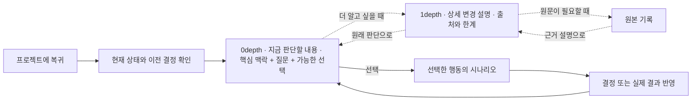
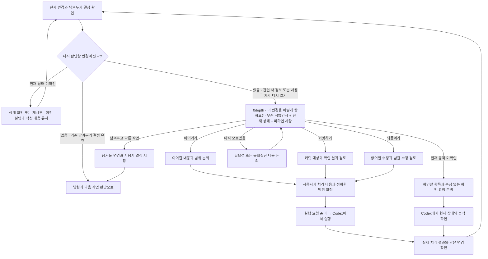
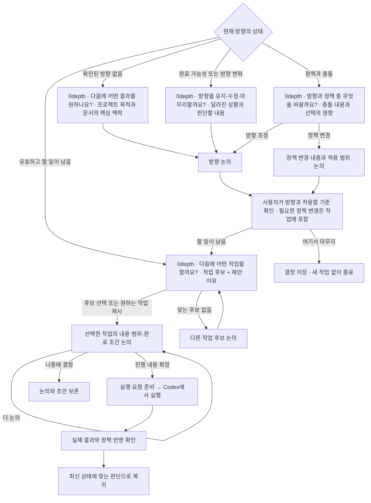

# StateCarry 프로젝트 상세 진입 흐름 — 판단 중심 확정안

2026-09-20 사용자가 승인한 개선 흐름이다. 기존 D1·D2 결정을 유지하고 현재 판단, 선택적 근거 확인, 행동별 진행을 분리했다. 목표 동작이며 앱 구현 완료를 뜻하지 않는다.

2026-09-21 이후의 제품 동작, 작업 전환, 우선순위, 의존 관계, 완료, 배포, 복귀 및 표현 규칙은 [제품 동작 계약](product-behavior-contract.md)을 우선한다. 이 문서는 그 계약으로 이어진 Project 상세 흐름의 이전 설계 기록으로 유지한다.

[최초 논의안](decisions/project-detail-entry-flow-initial-draft.md) · [상세 설계와 시안](project-detail-ui-ux-design.md)

## 공통 화면 구조 — 현재 판단과 근거

0depth에는 판단에 필요한 핵심 맥락, 지금 답할 질문, 가능한 선택을 함께 둔다. 현재 진행 상태와 중요한 미확인은 0depth에 남긴다. 1depth에는 상세 변경 설명과 판단 근거를 둔다. 근거 확인은 선택적 왕복 경로다. 박스 하나가 별도 화면 하나를 뜻하지 않는다.

<!-- mermaid:id=decision_depth -->

## ① 남아 있는 변경 처리

<!-- mermaid:id=remaining_changes -->

## ② 방향과 다음 작업 논의

<!-- mermaid:id=direction_and_next_work -->

## 확정된 결정

| ID  | 결정                                                       | 반영 방식                                                                                                                                                                                                                |
| --- | ---------------------------------------------------------- | ------------------------------------------------------------------------------------------------------------------------------------------------------------------------------------------------------------------------ |
| D1  | 변경을 남겨두고 다른 작업으로 이동할 수 있다.              | 어느 변경을 남겼는지와 사용자 결정을 기억한다. 같은 상태로 복귀했다는 이유만으로 처리 화면을 반복하지 않는다. 관련 변경에 새 정보가 생기거나 사용자가 다시 열면 해당 부분을 재검토한다. 남은 변경은 계속 확인할 수 있다. |
| D2  | 방향과 정책이 충돌하면 어느 쪽을 바꿀지 사용자가 결정한다. | 충돌과 영향을 먼저 설명한다. 방향 조정 또는 정책 변경을 논의하며 자동으로 어느 한쪽을 덮어쓰지 않는다. 미해결 충돌을 무시한 실행은 시작하지 않는다.                                                                      |

두 항목 모두 사용자가 추천안을 선택해 확정했다. 점선 제안 경로를 확정된 경로로 변경했다.

## 다이어그램을 읽는 기준

- staged와 unstaged 모두 남아 있는 변경이다. 상태를 확인하지 못한 경우는 변경 없음과 구분하고 마지막으로 아는 상태와 한계를 보여준다.
- 변경 분류는 남아 있는 변경을 이해하고 처리하기 위한 것이다. 새 할 일, 과거 의도, 사용자 결정으로 자동 확정하지 않는다. 분류가 부정확하면 사용자가 수정할 수 있다.
- 무엇을 바꾸는 작업인지와 판단에 중요한 미확인을 짧게 설명하고 행동을 함께 보여준다. 자세한 발견 내용은 선택적으로 펼친다. 정확한 실행 범위는 선택한 행동의 시나리오 안에서 확인한다.
- 커밋과 되돌리기는 대상 변경의 범위를 확인한다. 한 파일에 다른 작업이 섞였다고 파일 전체를 자동 포함하지 않는다. staged 해제와 실제 수정 내용 폐기는 별개 행동이다.
- 깨끗한 Git 상태는 완료의 증거가 아니다. 검토하지 않은 결과가 있다면 검토·검증이 다음 작업이 될 수 있다.
- 프로젝트 목적은 존재 의의, 현재 방향은 지금 달성하려는 결과다. 내부 문서에서 발견한 목적·방향에는 출처와 한계를 표시하고 사용자 확인 없이 확정하지 않는다.
- 사용자는 추천 작업 대신 원하는 작업을 직접 제시할 수 있다. 작업을 선택하면 해당 주제의 논의를 시작하며 곧바로 실행하지 않는다.
- 논의 시작이나 답변 열람은 방향 수정, 작업 실행, 결과 수락을 뜻하지 않는다. 모든 논의에서 결정을 미루고 나갈 수 있다. 완료한 방향 다음에 새 방향을 즉시 정하도록 강제하지 않는다.

## 논의와 실행의 위치

- 현재 작업에 관한 논의는 StateCarry 안에서 해당 작업에 붙여 진행한다.
- 기존에 정한 범위대로 목표 정의 논의와 실제 코딩은 Codex로 연결한다. 방향·정책을 논의한 결과는 사용자가 확인한 뒤 StateCarry에 반영한다.
- 현재 실행 범위에서 커밋·되돌리기·코딩은 범위를 검토하고 요청을 준비해 Codex로 연결한다. 자동 전송이 지원되지 않으면 요청문 복사를 제공한다. 준비·복사를 실제 실행으로 표시하지 않는다.
- 외부 실행 후 실제 프로젝트 상태를 다시 읽어 결과를 확인한다. 요청 준비만으로 변경을 처리 완료로 표시하지 않는다.
- 일부 변경만 처리했다면 나머지는 계속 남아 있다. 이전에 남겨두기로 한 결정은 해당 범위에만 적용한다.
- 정책 변경이 필요한 방향을 택했다면 그 변경도 다음 작업에 반영한다. 정책 충돌이 자동으로 해결됐다고 취급하지 않는다.

## 설계와 시안 반영

- 현재 판단 → 선택별 논의·검토 → 사용자 확정 → 요청 준비 순서로 반영한다.
- 처리 방법을 보기 위해 정확한 범위를 먼저 확정하도록 강제하지 않는다. 실행 요청 전에는 범위를 확정한다.
- staged 변경도 처리 대상이다. 불확실한 현재 상태를 변경 없음으로 간주하지 않는다.
- 남겨둔 변경에 새 정보가 생기면 해당 범위만 다시 판단하며, 다른 범위의 결정과 작성 중 내용은 유지한다.
- 정책 수정 자체를 작업으로 준비할 수 있다. 정책 반영 확인 전에는 충돌하는 작업을 실행하지 않는다.
- 방향 마무리는 사용자 결정이다. 새 작업을 만들지 않고 종료할 수 있다.
- [UI/UX 설계](project-detail-ui-ux-design.md)와 [시안](design/project-detail/index.html)에서 화면 깊이와 선택 이후 동작을 확인한다.
